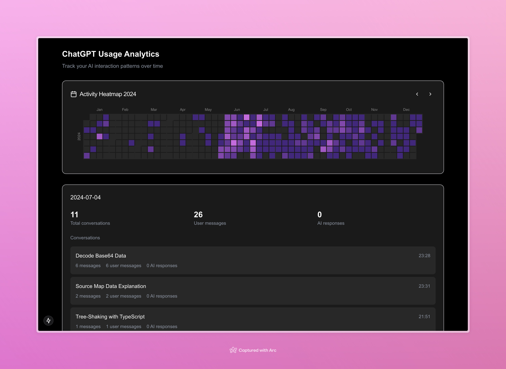

# ChatGPT Usage Analytics

Upload ChatGPT's exported data and get insights on your usage patterns.

## Tech Stack

- **Next.js 15** with App Router
- **Zod** for runtime validation using zod-mini for optimal bundle size
- **Jotai** for atomic state management
- **@nivo/calendar** for heatmap visualization
- **Tailwind CSS v4** for styling
- **TypeScript** for type safety

## Inspired by

- [James Hall's project](https://www.linkedin.com/posts/mrrio_i-made-a-nice-github-style-ai-usage-heatmap-activity-7288091697190772736-RUt4?utm_source=share&utm_medium=member_desktop)

## License

[MIT](./LICENSE)
